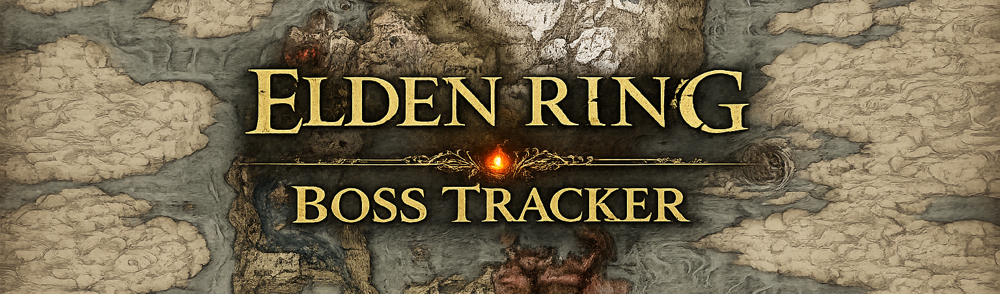
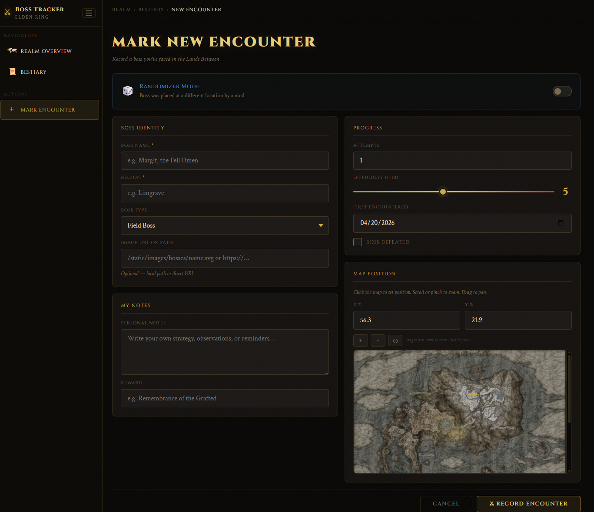
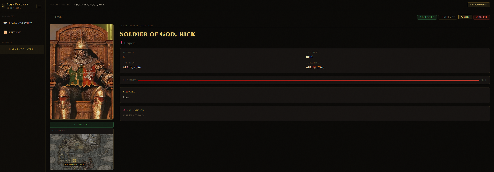
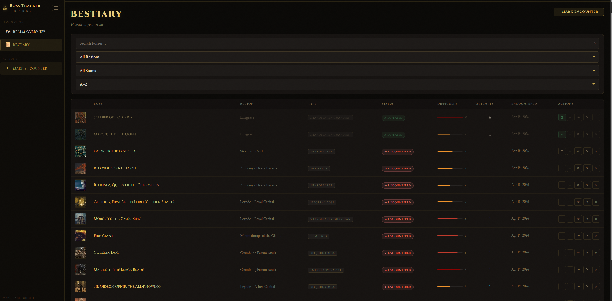

# ⚔🌙 Elden Ring Boss Tracker

<p align="center">
  
</p>

> **This project is still under active development.** Features are being added, refined, and polished. Expect improvements, and feel free to contribute ideas.

---

> **Image Rights** — All images, screenshots, and game assets used in this project belong to their respective authors and rights holders. This project is non-commercial and made purely for fun. If you are the owner of any image displayed here and would like it removed, please [open an issue](../../issues) on this repository and it will be taken down promptly.

A fun personal web app for tracking your Elden Ring boss attempts, notes, and journey progress. Whether you're doing a normal playthrough or using a randomizer mod, the tracker lets you log every encounter, mark defeats, pin boss locations on the interactive map, and export your full journey to a styled PDF.

---

## Screenshots

### Realm Overview — Interactive World Map
The main dashboard shows all tracked bosses pinned on the Elden Ring world map with attempt counts, story order numbers, and animated journey paths between mandatory bosses.


---

### Boss Detail Panel
Click any marker on the map or any item in the left panel to slide open the boss detail panel — showing portrait, status, difficulty rating, your personal notes, reward, and quick actions (modify, delete and etc.).


---

### Add New Encounter
Record a new boss encounter with name, region, difficulty, attempts, personal notes, and map position. An interactive zoomable/pannable map picker lets you drop a pin at the exact location. Known mandatory bosses auto-fill their coordinates.



---

### Edit and Delete
Update any boss's information — mark it defeated, change attempt count, edit notes, reposition on the map, or delete it entirely.



---

### Search and Bestiary
The Bestiary page lets you search, filter by region or status, and sort bosses by name, difficulty, attempts, or encounter date.



---

## Features

- **Interactive world map** — pan and zoom the Elden Ring map, with boss portrait markers showing attempt counts and story order numbers. Animated dashed paths connect mandatory bosses in story order, coloured gold (undefeated) or green (defeated).
- **Boss detail side panel** — click any marker to see full boss info without leaving the map.
- **13 mandatory bosses pre-loaded** — all story-required bosses seeded automatically with correct map coordinates and rewards on first run.
- **Add / Edit / Delete bosses** — full CRUD for any boss encountered, with a zoomable map picker for precise positioning.
- **Personal notes** — each boss has a free-text notes field for your own strategy tips, observations, and reminders. Notes are yours — nothing is pre-filled.
- **Randomizer mode** — if you're using a boss randomizer mod, toggle Randomizer Mode when adding or editing a boss to override the default map position with any named location slot. This lets you track which boss appeared at which slot and adjust map pins accordingly.
- **Attempt tracking** — log every attempt with a single click from the map panel or bestiary table. Badges on map markers turn yellow at 5+ attempts and red at 10+.
- **Difficulty rating** — rate each boss 1–10 with a slider. Bestiary shows a visual bar.
- **PDF export** — export your full playthrough to a 3-page PDF:
  - **Page 1:** The world map with boss markers, attempt badges, story order numbers, journey path lines, and a defeated/undefeated/path legend — all composited onto the map image at high resolution.
  - **Page 2:** Full statistics table with portraits, regions, status, attempts, and difficulty ratings for every boss.
  - **Page 3:** Personal notes journal — every boss listed with your notes and rewards.
- **Cursor HUD** — hover the map to see live X%, Y% coordinates and current zoom scale in the top-right corner.
- **Fixed legend** — the defeated/undefeated/path legend stays anchored to the bottom-left of the visible screen no matter how far you scroll or zoom the map.
- **Live search** — the Bestiary filters rows instantly as you type, no page reload needed.

---

## Project Structure

```
elden-ring-boss-tracker/
│
├── app.py                          # Flask app, routes, DB model, base64 export logic
├── requirements.txt                # Python dependencies
│
├── templates/
│   ├── base.html                   # Shared layout: sidebar, topbar, flash messages
│   ├── index.html                  # Realm Overview: map, boss list, PDF export
│   ├── boss_list.html              # Bestiary: search, filter, sort table
│   ├── boss_detail.html            # Single boss detail page with 3D portrait
│   ├── add_boss.html               # Add new encounter form with map picker
│   └── edit_boss.html              # Edit existing boss form with map picker
│
├── static/
│   ├── css/
│   │   └── style.css               # All styles: layout, map, markers, forms, PDF
│   ├── js/
│   │   └── app.js                  # Sidebar toggle, animations, legend positioning
│   └── images/
│       ├── map/
│       │   └── ER_MAP.jpeg         # World map images
│       └── bosses/
│           ├── margit.png          # Boss portraits
│           ├── godrick.png
│           └── ... (13 total)
│
└── instance/
    └── bosses.db                   # SQLite database (auto-created on first run)
```

---

## Database

The app uses **SQLite** via **Flask-SQLAlchemy**. The database file `instance/bosses.db` is created automatically on first run — no setup needed.

### `Boss` table — columns

| Column | Type | Description |
|---|---|---|
| `id` | Integer | Primary key |
| `name` | String | Boss name |
| `region` | String | In-game region |
| `map_x` | Float | Horizontal position on map (0–100%) |
| `map_y` | Float | Vertical position on map (0–100%) |
| `defeated` | Boolean | Whether the boss has been defeated |
| `attempts` | Integer | Total number of attempts |
| `difficulty_rating` | Integer | Player rating 1–10 |
| `player_notes` | Text | Your personal notes (free text) |
| `reward` | String | Item/rune reward on defeat |
| `first_encounter_date` | Date | When you first fought this boss |
| `defeated_date` | Date | When you finally defeated them |
| `boss_type` | String | e.g. Shardbearer, Demi-God, Final Boss |
| `image_url` | String | Path to portrait image |
| `randomizer_slot` | String | Randomizer location slot name (if applicable) |
| `is_randomized` | Boolean | Whether this boss was placed by a randomizer |
| `is_mandatory` | Boolean | Whether this is a required story boss |
| `display_order` | Integer | Story order (1–13 for mandatory, 999 for extras) |

### Utility routes

| Route | Purpose |
|---|---|
| `/seed` | Re-seeds the 13 mandatory bosses if the DB is empty |
| `/migrate` | Upgrades an older DB (renames `weakness_notes` → `player_notes`) |
| `/debug/static-check` | Confirms that static image files are found correctly |

---

## Getting Started

```bash
# Clone or unzip the project
cd elden-ring-boss-tracker

# Create a virtual environment
python3 -m venv venv
source venv/bin/activate        # Windows: venv\Scripts\activate

# Install dependencies
pip install -r requirements.txt

# Run the app
python app.py
```

Open `http://127.0.0.1:5000` in your browser. The database and all 13 mandatory bosses are created automatically on first run.

---

## Dependencies

| Package | Version | Purpose |
|---|---|---|
| Flask | 3.0.3 | Web framework |
| Flask-SQLAlchemy | 3.1.1 | ORM / database layer |
| SQLAlchemy | 2.0.30 | SQL toolkit |
| Werkzeug | 3.0.3 | WSGI utilities |

No frontend frameworks — vanilla JavaScript, CSS, and Jinja2 templates only.

---

## Randomizer Mode

If you're playing with a boss randomizer mod, toggle **Randomizer Mode** when adding or editing a boss. This lets you:

- Override the default map coordinates with any named location slot (e.g. "Farum Azula Apex", "Haligtree Roots")
- Track which boss appeared at which slot
- See a 🎲 badge on randomized bosses in the map and bestiary
- Export your randomized run to PDF with accurate positions
---

*Good luck on your journey, Tarnished — may your path be guided by grace and your enemies fall before you.*
